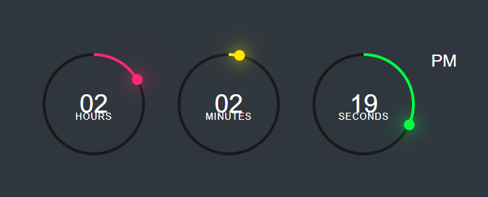

# 🕒 Digital Clock

A simple live digital clock built with HTML, CSS, and JavaScript.

## 📸 Screenshot

## 🚀 Live Demo

[Click here to view it live](https://kdmb12.github.io/Digital-Clock)

## 📂 How to Run

1. Clone or download this repo  
2. Open index.html in your browser

## 🛠 Tech Stack

- HTML5
- CSS3
- JavaScript

---

Made with ❤ by [kdmb12](https://github.com/kdmb12)
